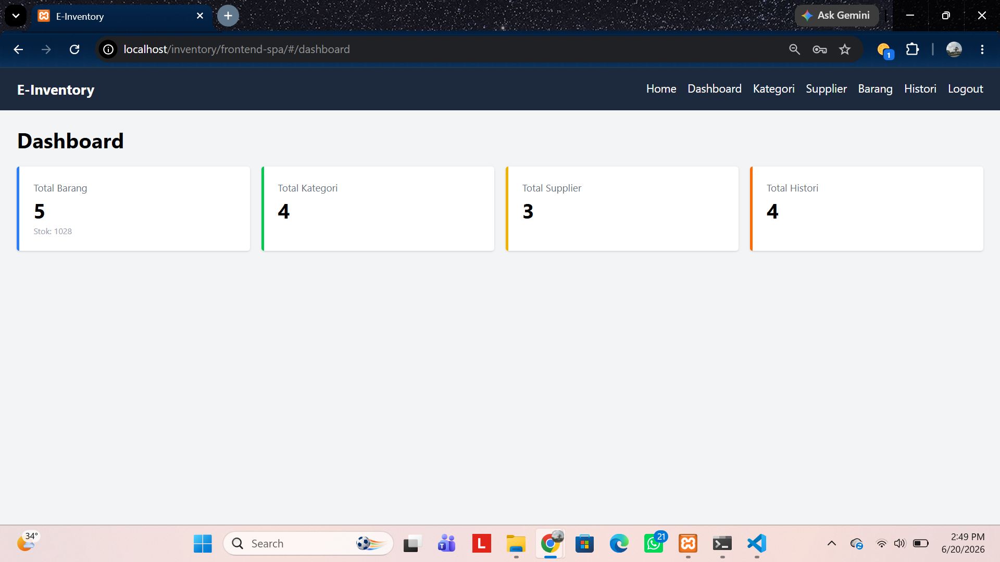
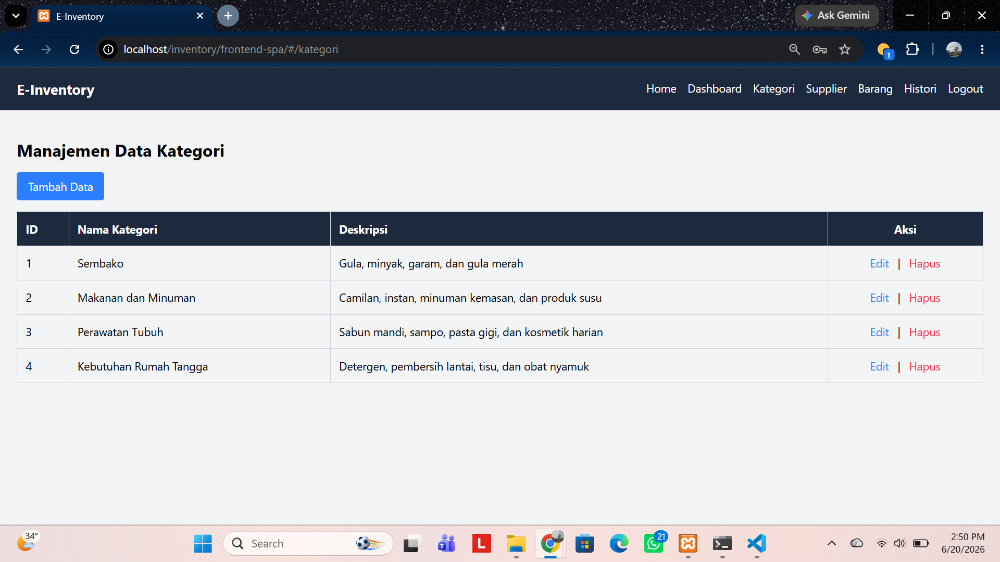

# UAS_Web2_312410382_Bagus_Aditya_Hermawan

# Judul: Sistem Manajemen Inventaris Barang (E-Inventory) Berbasis Vue.js dan CodeIgniter 4.

## Deskripsi Singkat: 
> E-Inventory merupakan sistem informasi berbasis web yang dirancang untuk membantu proses pengelolaan persediaan barang secara terintegrasi. Sistem ini menyediakan fitur manajemen data kategori, supplier, barang, serta pencatatan histori transaksi keluar dan masuk barang. Aplikasi dibangun menggunakan Vue.js dengan konsep Single Page Application (SPA) dan CodeIgniter 4 yang menyediakan layanan RESTfull API. Sistem menerapkan hak akses yang berbeda antara public dan admin, di mana pengunjung hanya dapat melihat halaman beranda (landing page), sedangkan admin dapat melakukan login untuk mengelola seluruh data inventaris. Dengan adanya sistem ini, proses pengelolaan stok menjadi lebih terstruktur, efisien, dan terintegrasi.

## Spesifikasi Teknologi Yang Digunakan
- Backend Engine: Codelingniter 4
- Frontend Engine: Vue.js 3, Vue Router
- UI: TailwindCSS
- Data Transfer: Library Axios dan MySQL

## Fitur Aplikasi
Backend: 
- Relasi Tabel
- RESTfull Endpoints
- Server-Side Security
- Penanganan CORS

Frontend:
- Sistem Login
- Client-Side Security
- Axios Interceptors
- TailwindCSS

Hak Akses
- Pengunjung: halaman beranda
- Administrator: Mengelola data master dan aktivitas logout.

## Dokumentasi Database dan Uji Coba
Skema relasi tabel databse
##### .

Uji tembak API gagal (error 401)
##### .

## Dokumentasi Antarimuka Aplikasi (UI)
### 1. Halaman login
##### .

### 2. Halaman Home dan dashboard admin
##### .
##### .

### 3. Halaman Home pengunjung
##### .
### 4. Form modal
Modal tambah:
- Barang dan Stok
##### .
- Supplier
##### .
- Histori
##### .
- Kategori
##### .

Modal Edit:
- Barang dan Stok
##### .
- Supplier
##### .
- Histori
##### .
- Kategori
##### .

### 5. Tabel data
- Barang dan Stok
##### .
- Supplier
##### .
- Histori
##### .
- Kategori
##### .


## Petunjuk Instalasi — E-Inventory (Backend & Frontend) 

#### Menyiapkan Database

1. Pertama-tama Buka XAMPP Control Panel, lalu start Apache dan MySQL. Agar nantinya ketika di coba dibrowser dapat berjalan.
2. Membuka halaman admin di phpMyadmin pada MySQL.
3. Kemudian saya membuat database dengan nama db_inventory.
4. Mengimport file SQL struktur tabel (`kategori`, `barang`, `supplier`, `histori_barang`, `users`) ke database.

### 2. Menjalankan Backend (CodeIgniter 4)
1. Membuka shell pada Xampp lalu, jalankan perintah berikut:
   ```
   php spark serve
   ```
2. Membuka file `.env` di folder backend, lalu koneksi database yang telah dibuat hubungkan pada file ini:
   ```
   CI_ENVIRONMENT = development

   database.default.hostname = localhost
   database.default.database = db_inventory
   database.default.username = root
   database.default.password =
   database.default.DBDriver = MySQLi
   ```
3. Backend dapat diakses melalui Apache.
   ```
   http://localhost:8080/
   ```
4. Kemudian Uji coba backend berjalan dengan menembak pada postman:
   ```
   http://localhost:8080/api/dashboard-summary
   ```
   Dengan Method GET. Hasilnya jika berhasil akan muncul response JSON yg berisi data.

### 3. Menjalankan Frontend (Vue 3 via CDN)

1. Membuka folder project frontend.
   ```
   C:\xampp\htdocs\inventory\frontend-spa
   ```
2. Membuat `apiUrl` di file app.js frontend menunjuk ke alamat backend yang sudah dibuat:
   ```javascript
   const apiUrl = 'http://localhost:8080';
   ```
3. Uji coba menggunakan Xampp dengan mengakses frontend melalui browser.
untuk admin:
   ```
   http://localhost/inventory/frontend-spa/
   ```
untuk public:
   ```
   http://localhost/inventory/frontend-spa/public.html#/
   ```

### 4. Login ke Sistem

Menggunakan akun admin yang sudah dibuat pada database.
username/email: admin@inventory.com.
password: admin123.

Link demo:.
Link presentasi proyek:.
