# UAS_Web2_312410382_Bagus_Aditya_Hermawan

# Judul: Sistem Manajemen Inventaris Barang (E-Inventory) Berbasis Vue.js dan CodeIgniter 4.

## Deskripsi Singkat: 
> E-Inventory merupakan sistem informasi berbasis web yang dirancang untuk membantu proses pengelolaan persediaan barang secara terintegrasi. Sistem ini menyediakan fitur manajemen data kategori, supplier, barang, serta pencatatan histori transaksi keluar dan masuk barang. Aplikasi dibangun menggunakan Vue.js dengan konsep Single Page Application (SPA) dan CodeIgniter 4 yang menyediakan layanan RESTfull API. Sistem menerapkan hak akses yang berbeda antara public dan admin, di mana pengunjung hanya dapat melihat halaman beranda (landing page), sedangkan admin dapat melakukan login untuk mengelola seluruh data inventaris. Dengan adanya sistem ini, proses pengelolaan stok menjadi lebih terstruktur, efisien, dan terintegrasi.

## Spesifikasi Teknologi Yang Digunakan
- Backend Engine: Codelingniter 4
- Frontend Engine: Vue.js 3, Vue Router
- UI: TailwindCSS
- Data Transfer: Library Axios dan MySQL

## Fitur Aplikasi
Backend: 
- Relasi Tabel
- RESTfull Endpoints
- Server-Side Security
- Penanganan CORS

Frontend:
- Sistem Login
- Client-Side Security
- Axios Interceptors
- TailwindCSS

Hak Akses
- Pengunjung: halaman beranda
- Administrator: Mengelola data master dan aktivitas logout.

## Dokumentasi Database dan Uji Coba
Skema relasi tabel databse
##### 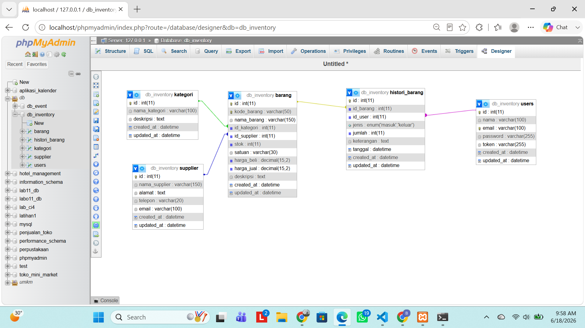.

Uji tembak API gagal (error 401)
##### 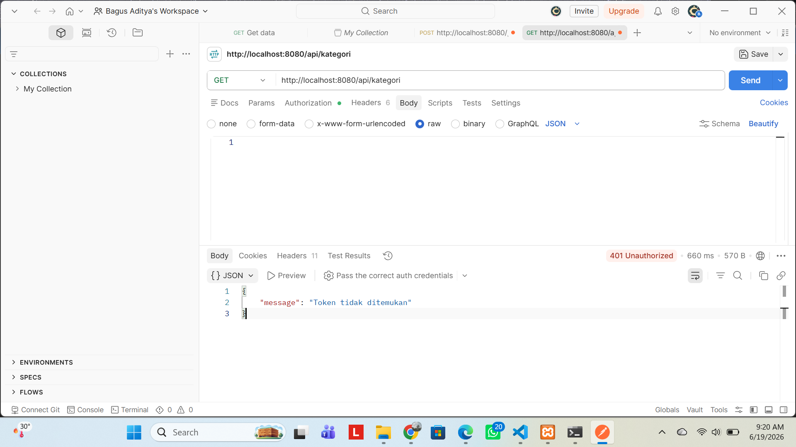.

## Dokumentasi Antarimuka Aplikasi (UI)
### 1. Halaman login
##### 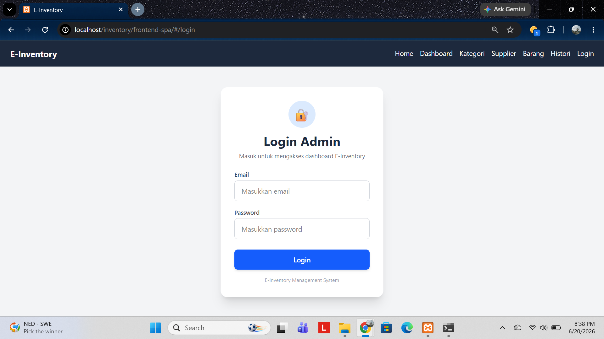.

### 2. Halaman dashboard admin
##### 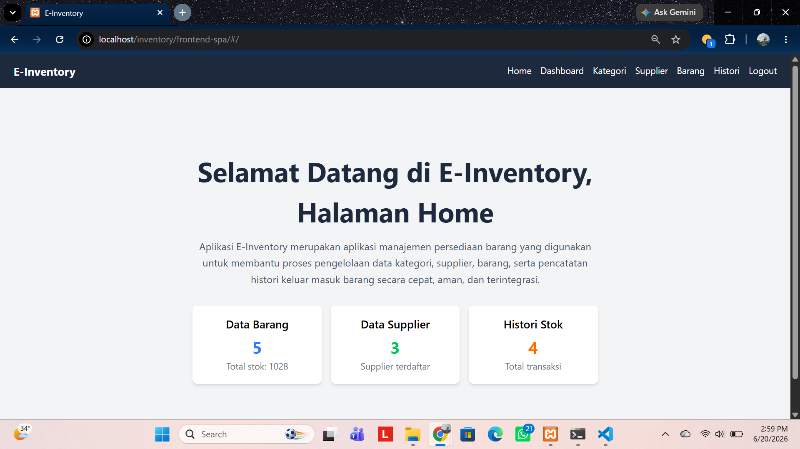.

### 3. Form modal
- Modal tambah:
- Barang dan Stok
##### 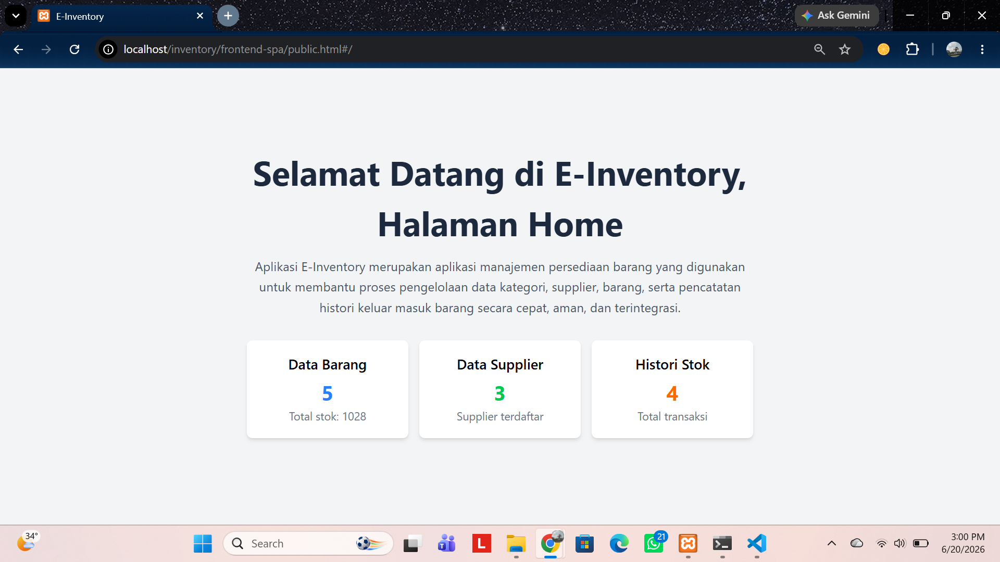.
- Supplier
##### .
- Histori
##### 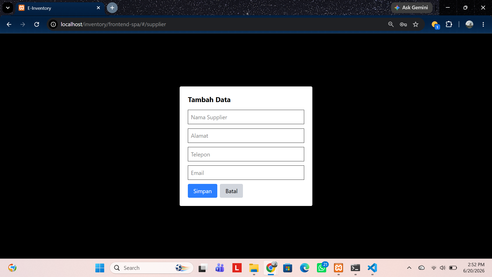.
- Kategori
##### .

- Modal Edit:
- Barang dan Stok
##### 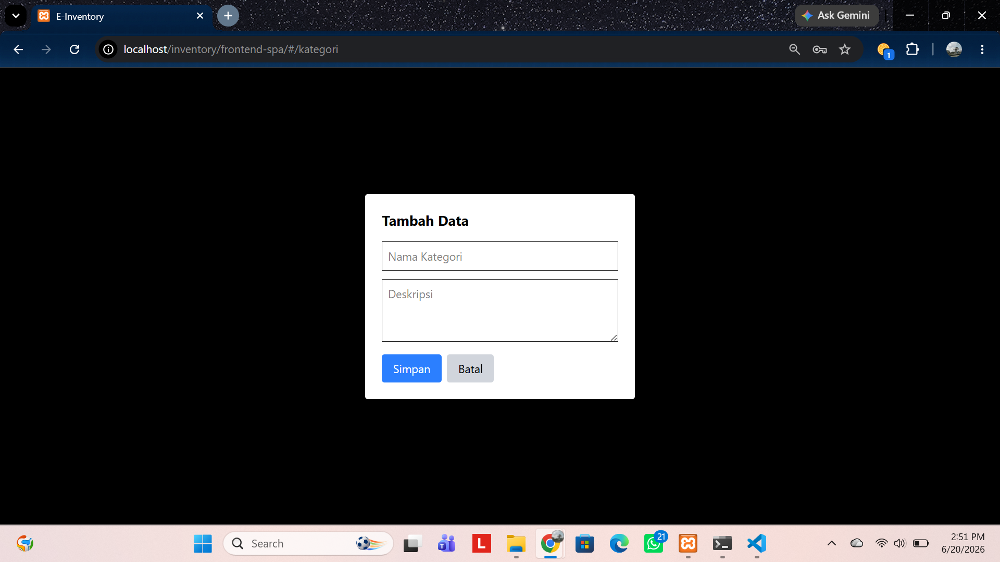.
- Supplier
##### 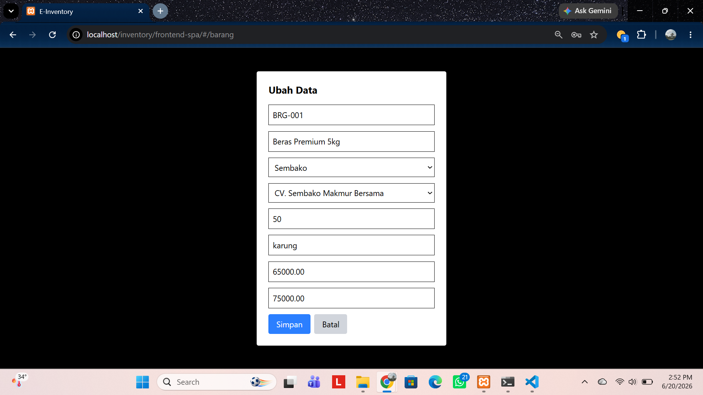.
- Histori
##### 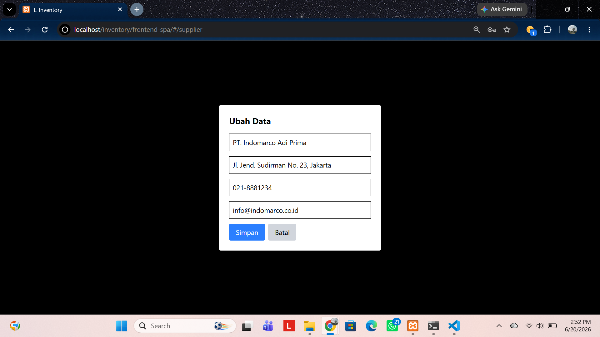.
- Kategori
##### 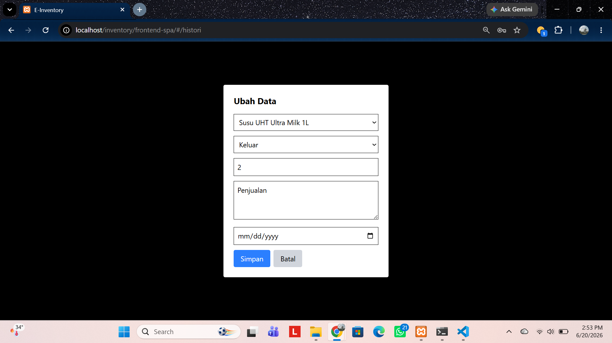.

### 4. Tabel data
- Barang dan Stok
##### .
- Supplier
##### 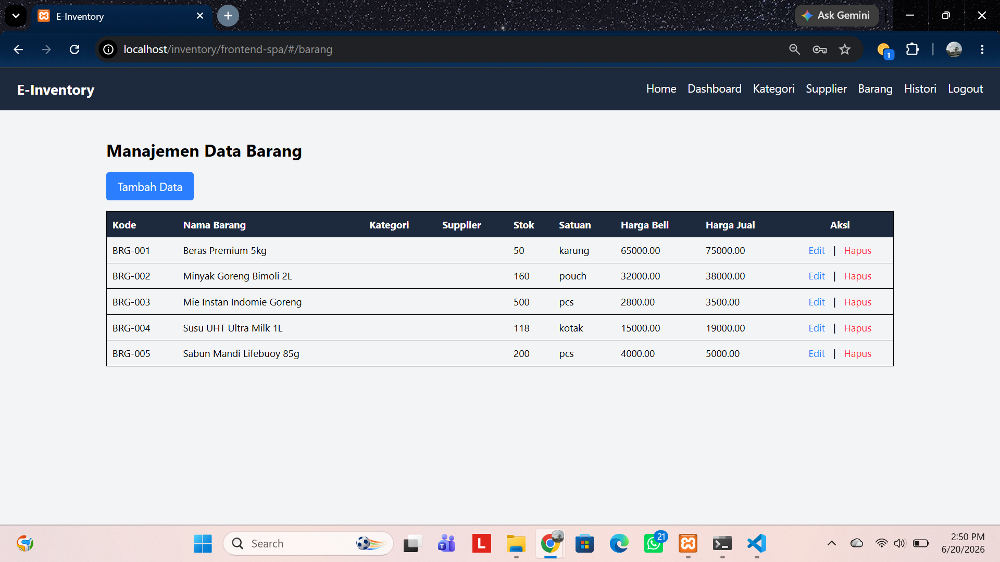.
- Histori
##### 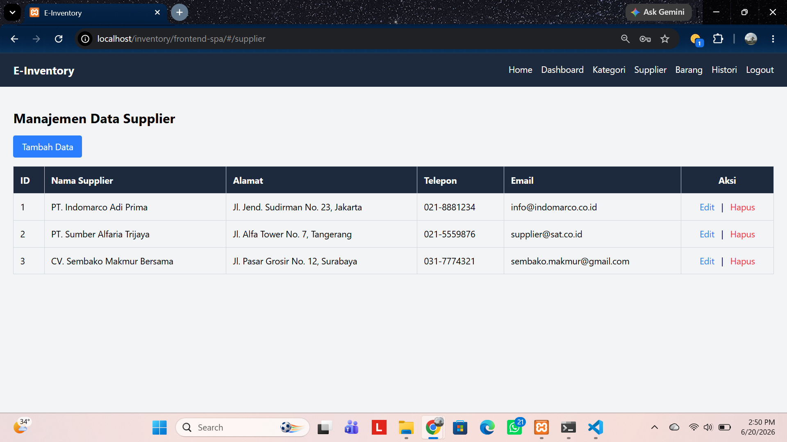.
- Kategori
##### 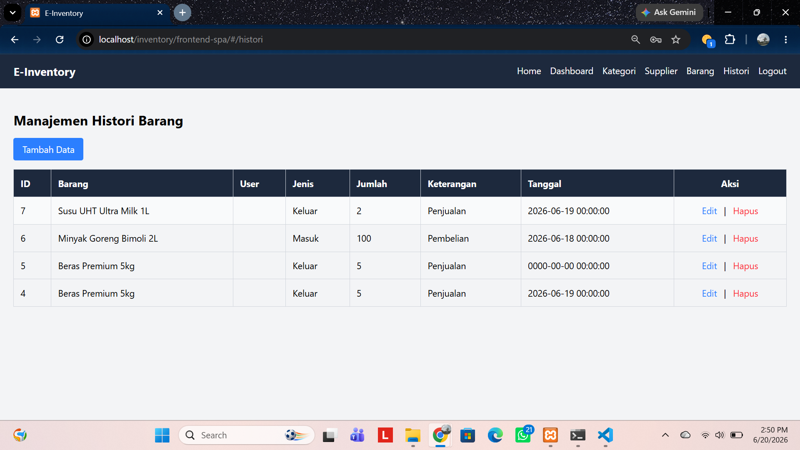.
